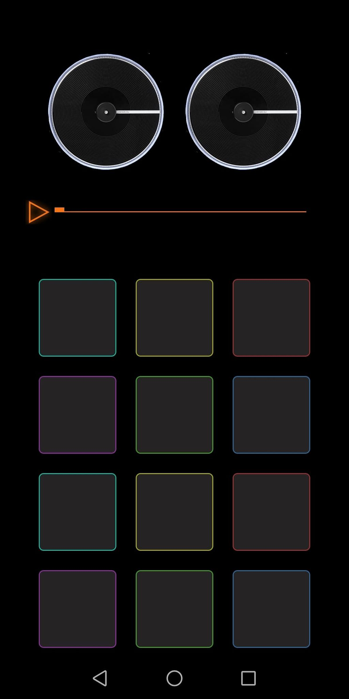
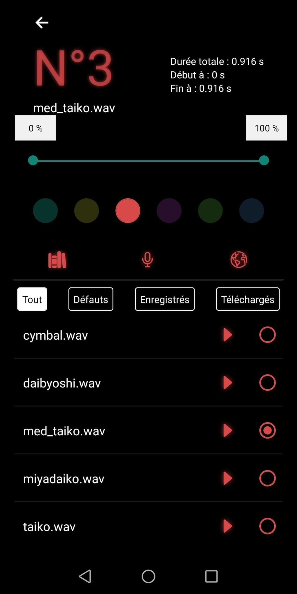
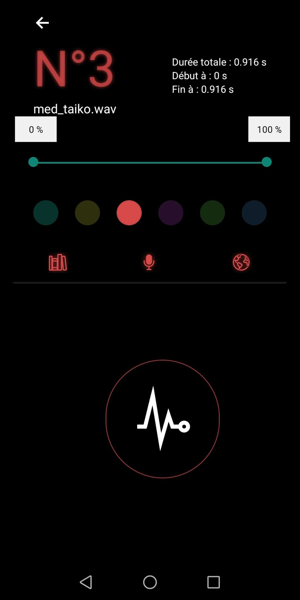
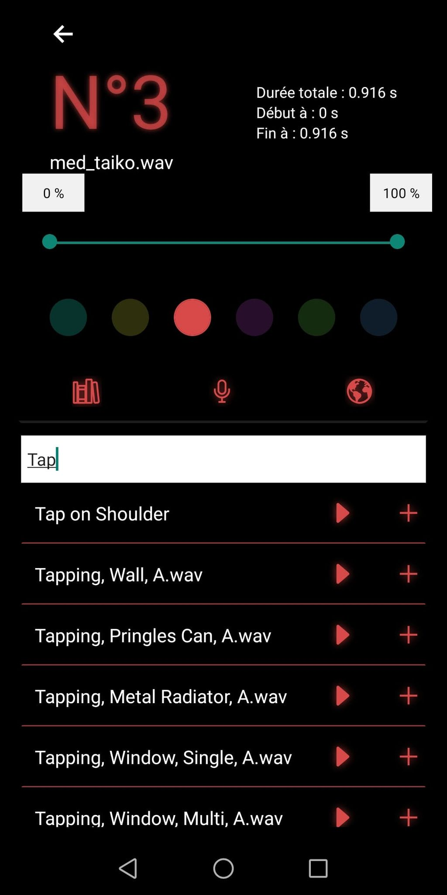

# Main screen 
   

# The Project Structure
    ## components
    (This Folder contains all usefull components of the app)
        ### edit
            * Freesound.js
            * Locallib.js
            * Micro.js
            * Sample.js
        ### filter
            * filterComp.js
        ### reusable
        (This folder contains JS objects or JS methods that can be used anywhere in the app)
            * color.js
            * defaultBtn.js
            * defaultSong.js
            * freesoundAPI.js
            * songInfo.js
        * Soundboard.js
    ## reducers
        * btnSlice.js
        * filterSlice.js
        * librairieSlice.js
    ## services
        * downloadSong.js
        * playSong.js
        * requestPermission.js
    ## store
        * store.js
    ## style
        * communs.js
        * listSon.js
    * App.js